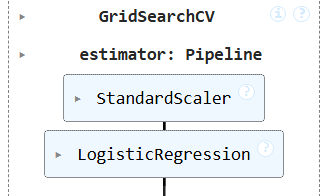
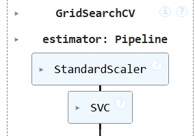
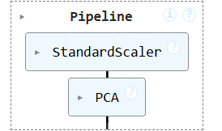
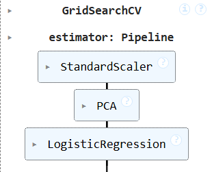
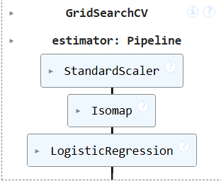
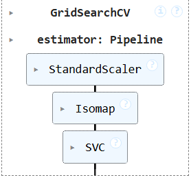
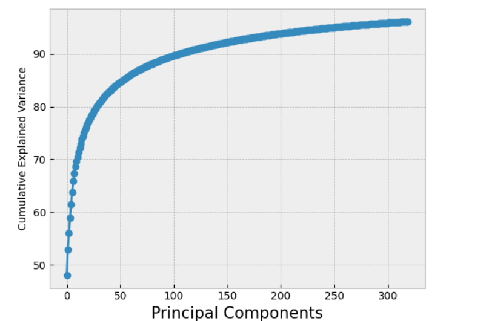
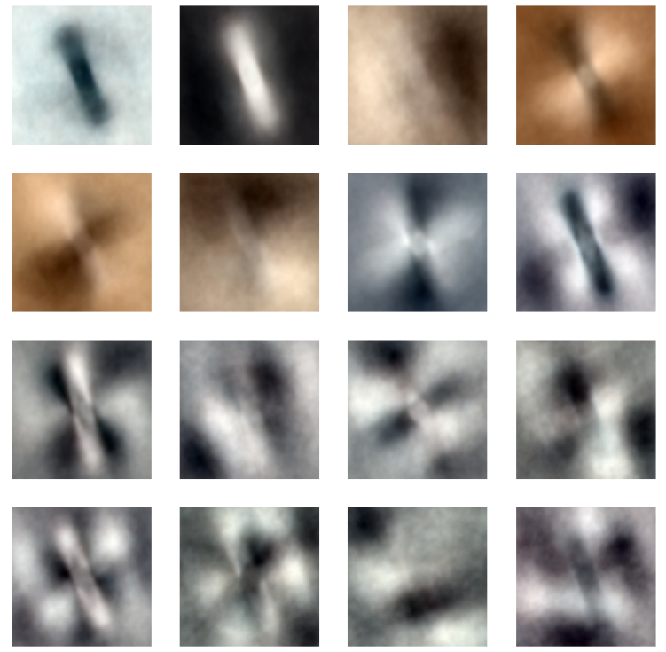
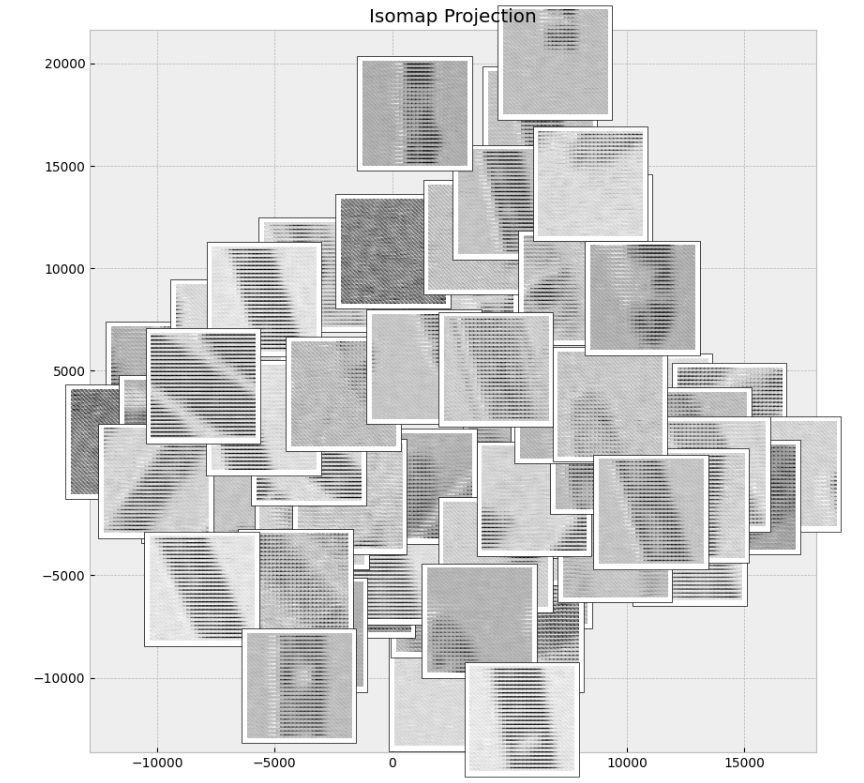
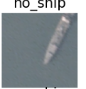

# Evaluating Dimensionality Reduction Techniques on Satellite Imagery Classification

**Taher Akolawala**

---

## Abstract

**Abstract—** This paper presents a comprehensive analysis of dimensionality reduction techniques applied to satellite imagery for automated ship detection. Using a dataset of 4,000 labeled 80×80 RGB images from San Francisco and San Pedro Bays, I investigate the impact of feature space reduction on classification performance and computational efficiency with the goal of providing actionable insights for operational maritime monitoring systems. In this paper, I employ initial exploratory data analysis of the high-dimensional image data (19,200 features), as well as multiple dimensionality reduction approaches including Principal Component Analysis (PCA) and manifold learning algorithms (Isomap and LLE) as preprocessing steps for classification. Multiple classifiers (SVM and Logistic Regression) were trained and evaluated across different dimensional spaces. I found that PCA w/ Support Vector Machine demonstrated superior performance with 150 components, achieving an accuracy of 92% and F1-score of 0.84, while reducing training time by 49% compared to a base SVM model. PCA analysis revealed that 109 components are required to explain 90% of the variance, with average reconstruction RMSE of 13.24. Based on these models and analysis of misclassification patterns, I offer data-driven recommendations for improving automated ship detection in satellite imagery systems.

---

## Introduction

Automated ship detection in satellite imagery has become increasingly critical for maritime surveillance, port activity monitoring, and supply chain analysis. As commercial satellite providers like Planet capture imagery of the entire Earth daily, the volume of data has outgrown manual analysis capabilities, necessitating robust machine learning solutions. However, satellite imagery presents a unique challenge: each 80×80 RGB image contains 19,200 features, creating a high-dimensional feature space that significantly impacts computational efficiency and model performance. Thus, it becomes critical to understand how dimensionality reduction techniques can maintain classification accuracy while improving training and inference times, enabling real-time deployment in operational maritime monitoring systems. The main aim of the project can be summarized in one question:

*How can dimensionality reduction optimize ship detection performance while minimizing computational costs?*

To address this question, four stages were taken in analysis:

1. **Baseline Classifier Evaluation:** Training multiple classifiers without dimensionality reduction, establishing performance benchmarks through comprehensive hyperparameter tuning.
2. **Exploratory Data Analysis (EDA):** Identifying initial trends and patterns in tipping behavior.
3. **Predictive Modeling:** Building and tuning robust regression models to predict tip amount and quantify the impact of various trip characteristics.

Finally, the report aims to provide actionable recommendations for operational deployment of ship detection systems in satellite imagery analysis.

---

## Data Set and Methodoloy

The dataset consists of 4000 80 80×80 RGB images labeled with either a "ship" or "no-ship" classification. Images were derived from PlanetScope, which are orthorectified to a 3-meter pixel size. In order for any sort of machine learning analysis, I needed to ensure that the image data was properly structured. The raw images were flattened from their original three-dimensional shape into one-dimensional feature vectors, transforming each 80×80×3 image into a single array of 19,200 pixel values. This flattening process was essential for compatibility with traditional machine learning algorithms, but it also highlighted the severe curse of dimensionality inherent in image classification tasks. With nearly 20,000 features per sample, the computational cost of training models becomes prohibitive, making dimensionality reduction not just beneficial but necessary for practical implementation.

The dataset exhibits a significant class imbalance, with 1000 ship images and 3000 no-ship images. This 1:3 ratio reflects the real-world scenario where ships occupy relatively small portions of maritime surveillance imagery. To ensure fair comparison across all experiments, StandardScaler was applied to normalize the pixel values in all pipelines, preventing features with larger magnitudes from dominating the learning process. After all preprocessing steps were completed, the data was separated into a training and testing set with an 80/20 split, maintaining class proportions through stratified sampling.

---

## Expeimental Setup

The experimental framework was designed to systematically evaluate the impact of dimensionality reduction on classification performance and computational efficiency. I began with two baseline classifiers: Support Vector Machine (SVM) and Logistic Regression. SVM was chosen for its effectiveness in high-dimensional spaces and ability to find optimal decision boundaries through kernel methods, while Logistic Regression provided a simpler, interpretable baseline that is computationally efficient and well-suited for binary classification tasks. For both classifiers, comprehensive hyperparameter tuning was performed using GridSearchCV with 5-fold cross-validation. The search space for SVM included various kernel types (linear, RBF, polynomial), regularization parameters, and kernel coefficients, while Logistic Regression explored different regularization strengths and penalty types.

  
  

With baseline performance established, I moved onto Principal Component Analysis to understand the intrinsic dimensionality of the image data. PCA was fit on the training set to decompose the 19,200-dimensional feature space into orthogonal components ranked by explained variance. I systematically examined the cumulative variance explained to identify the minimum number of components needed to preserve 90% of the dataset variance. Reconstruction quality was evaluated by calculating root mean squared error between original and reconstructed images. This analysis informed the hyperparameter search space for subsequent PCA-enhanced pipelines. I then also reconstructed the training images with the top components found. More to be discussed in the results section

  

Building on these insights, I integrated PCA as a preprocessing step in the classification pipelines, treating the number of components as a hyperparameter alongside classifier-specific parameters. This ensured optimal dimensionality was selected in conjunction with the best classifier configuration.

  
  

Finally, I explored nonlinear dimensionality reduction through Isomap and Locally Linear Embedding (LLE). Isomap preserves global geometric properties through geodesic distances, while LLE preserves local neighborhood structures. Both methods were optimized through grid search, with manifold-reduced features fed into the same classifiers.

  
  

---

## Results

### Baseline Performance

The baseline classifiers established strong performance benchmarks without any dimensionality reduction. Both models achieved accuracy scores above 90%, with SVM slightly outperforming Logistic Regression at 90.84% compared to 90.66%. The F1 scores were similarly close, at 0.8308 and 0.8329 respectively, indicating balanced performance across both classes despite the 1:3 class imbalance. However, the computational costs were substantial. Logistic Regression required 63.15 seconds to train, while SVM completed training in 17.95 seconds. These training times highlight the computational burden of working directly with the full 19,200-dimensional feature space.

| Model Type          | Accuracy Score | F1 Score | Training Time |
|---------------------|----------------|----------|---------------|
| Logistic Regression | 0.9066         | 0.8329   | 63.15s        |
| SVM                 | 0.9084         | 0.8308   | 17.95s        |

### PCA Analysis

The PCA variance analysis revealed that 109 principal components were sufficient to explain 90% of the cumulative variance in the dataset. This represents a significant reduction from the original 19,200 features, compressing the data by over 99% while retaining most of the information. The figure below shows the cumulative explained variance curve, which rises steeply in the first 50 components before gradually plateauing.

  

To evaluate the quality of this compression, I reconstructed images from the reduced representation and calculated the root mean squared error between original and reconstructed images. The average RMSE was 13.24, indicating moderate reconstruction loss but acceptable fidelity for classification purposes. PCA Reconstruction shown below.

  

### PCA Enhanced Classification

Integrating PCA into the classification pipelines produced mixed results. Logistic Regression with PCA maintained nearly identical performance to the baseline, with accuracy of 90.69% and F1 score of 0.8334. More importantly, training time dropped dramatically to just 5.71 seconds, a 91% reduction from the baseline. SVM with PCA actually improved performance, achieving 92.22% accuracy and 0.8447 F1 score, the highest scores across all experiments. Training time for SVM with PCA was 8.95 seconds, cutting the baseline time in half while simultaneously improving accuracy. These results demonstrate that PCA successfully reduced computational costs without sacrificing performance, and in the case of SVM, actually enhanced it by removing noise and irrelevant features.

| Model Type                  | Accuracy Score | F1 Score | Training Time per Model |
|-----------------------------|----------------|----------|-------------------------|
| Logistic Regression w/ PCA  | 0.9069         | 0.8334   | 5.71s                   |
| SVM w/ PCA                  | 0.9222         | 0.8447   | 8.95s                   |

### Manifold Learning Results

The manifold learning techniques produced more varied results. Isomap performed reasonably well with both classifiers. Logistic Regression with Isomap achieved 0.8191 F1 score with an inference time of 0.229 seconds, while SVM with Isomap scored 0.8004 F1 with 0.235 second inference time. Both were slightly below PCA performance but still competitive with the baselines. The 2D Isomap projection in The figure below shows some clustering structure, with ship and no-ship samples occupying different regions of the manifold space, though with considerable overlap.

  

LLE, however, completely failed on this dataset. Despite extensive hyperparameter tuning across different numbers of neighbors, regularization parameters, and component dimensions, both Logistic Regression and SVM with LLE achieved F1 scores of exactly 0.0. The confusion matrices reveal that both models simply predicted the majority class (no-ship) for every single sample, resulting in perfect recall for no-ships but zero recall for ships. The LLE projection in the  figure below shows why this occurred: the manifold structure completely collapsed, with minimal separation between classes. This failure likely stems from LLE's assumption that the data lies on a locally linear manifold, which does not hold for this high-dimensional image dataset with complex nonlinear relationships.

  

I attempted to explore other manifold learning techniques such as t-SNE and UMAP, but these methods lack a transform function, meaning they cannot be applied to new test data. Since the goal was to build practical classification pipelines that generalize to unseen images, these techniques were not viable options despite their superior visualization capabilities.

| Model Type                     | Inference Time | F1 Score | Training Time per Model |
|--------------------------------|----------------|----------|-------------------------|
| Logistic Regression w/ Isomap  | 0.229s         | 0.8191   | 8.99s                   |
| SVM w/ Isomap                  | 0.235s         | 0.8004   | 15.78s                  |
| Logistic Regression w/ LLE     | 0.198s         | 0.0      | 6.29s                   |
| SVM w/ LLE                     | 0.195s         | 0.0      | 6.17s                   |

---

## Discsusion

### Optimal Pipeline Selection

Based on the comprehensive evaluation across all experiments, SVM with PCA emerges as the optimal pipeline for ship detection in satellite imagery. This pipeline achieved the highest accuracy of 92.22% and F1 score of 0.8447, while simultaneously reducing training time to 8.95 seconds compared to 17.95 seconds for the baseline SVM. The confusion matrix for SVM with PCA shows strong performance across both classes, with only 66 false positives and 103 false negatives out of 3,200 test samples. This represents a favorable precision-recall balance, which is critical for operational deployment where both missing actual ships and triggering false alarms carry operational costs.

The success of SVM with PCA can be attributed to several factors. First, PCA effectively filtered out noise and redundant features from the high-dimensional pixel space, allowing the SVM to focus on the most informative variance directions. Second, the regularization inherent in dimensionality reduction prevented overfitting, which likely explains why PCA-enhanced SVM outperformed the baseline despite using fewer features. Finally, the reduced feature space allowed the SVM's kernel computations to operate more efficiently, cutting training time in half.

### Miclassificaiton Analysis

Examining misclassified samples reveals clear patterns. The  figure below shows a ships incorrectly predicted as "no-ship." Most mislabeled images share similar traits: they are low contrast images where ships blend into surrounding water, providing few distinct features for the models to detect. The images lack clear structural cues like strong edges or visible waves that models learn to associate with ships. Poor atmospheric conditions, smaller vessels, and certain sun angles that minimize shadows proved particularly problematic. An example of one is shown below. 

  

To address these issues, I recommend data augmentation to generate low-contrast training examples, incorporating texture descriptors like edge detection filters, and implementing confidence thresholds to flag uncertain predictions for manual review in operational deployment.

---

## Conclusion

This paper investigated dimensionality reduction for ship detection in satellite imagery. Through systematic evaluation, I demonstrated that dimensionality reduction can simultaneously improve efficiency and accuracy. SVM with PCA achieved 92.22% accuracy while reducing training time by 50%, compressing 19,200 features to 109 components. In contrast, LLE completely failed, highlighting that not all dimensionality reduction approaches suit image classification. Analysis revealed low-contrast images as the primary challenge, suggesting future work should focus on augmentation and feature engineering. For operational deployment, I recommend SVM with PCA as a practical solution that enables real-time processing while maintaining strong detection performance.
